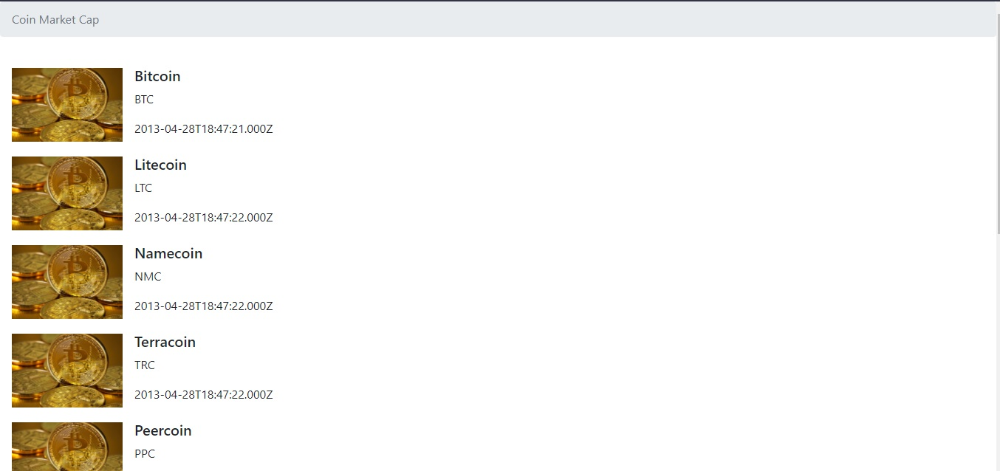

# Digital Innovation One

    

# Goal
Learn how to make a request for a cryptocurrency API with JavaScript.

# To Work
Enable the extension Moesif CORS and be connected to the site <a href="https://pro.coinmarketcap.com/">CoinMarketCap</a>

#

Project Web using the Coin Market Cap API 
[Developer Portal](https://pro.coinmarketcap.com/account)  
[Authentication documentation](https://coinmarketcap.com/api/documentation/v1/#section/Authentication)  
[API Documentation](https://coinmarketcap.com/api/documentation/v1/#)  
